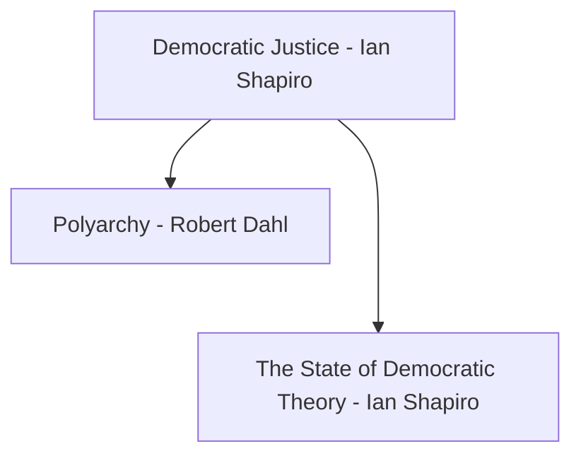
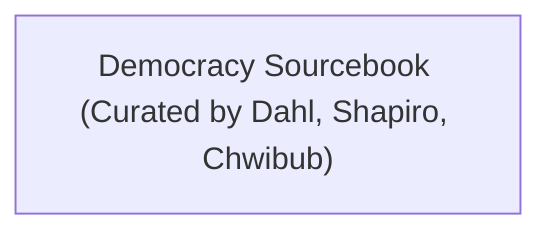

# Sammy's List

### Readings from Shapiro Courses
1. Democratic Justice - Ian Shapiro
2. Responsible Parties - Ian Shapiro
3. [[Shared Articles/After Virtue - Alasdair MacIntyre|After Virtue - Alasdair MacIntyre]]
	- Sam: chapters 1-3 read
4. Strangers in Their Own Land - Arlie Russell Hochschild

### Canada
1. Responsible Parties - Ian Shapiro
2. The Friendly Dictatorship - Jeffrey Simpson
3. Has the Canadian Prime Minister become 'Presidentialized'? - John C. Courtney
4. Reflections on Comparing Federalisms: Canada and the United States - Richard Simeon, Beryl A. Radin

### Communitarianism
1. [[Shared Articles/After Virtue - Alasdair MacIntyre|After Virtue - Alasdair MacIntyre]]
2. Why Liberalism Failed - Patrick Deneen

### Miscellaneous
1. Muslims and Citizens: Islam, Politics, and the French Revolution - Ian Coller

# David's List

## Revolutionaries and Reactionaries Track

## Democratic Theory Track

## Theories of Conservatism

- 

1. The Rhetoric of Reaction by Albert Hirschman (moderate, also wrote "Exit, Voice, Loyalty")
2. The Reactionary Mind: Conservatism from Edmund Burke to Sarah Palin

## Miscellaneous

1. [[Liberalism and Conservatism - Patrick Deneen]] (brief series of incomplete lecture notes)
2. Matt Sitman's article [Leaving Conservatism Behind](https://www.dissentmagazine.org/article/leaving-conservatism-behind-blue-collar-republican-progressive/) 
3. Governance Podcast (also possibly look for other similar political/social science podcasts)