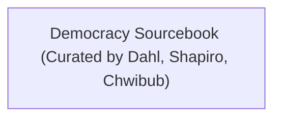

# Sammy's List

1. Democratic Justice - Ian Shapiro
2. Responsible Parties - Ian Shapiro
3. [[Shared Articles/After Virtue - Alasdair MacIntyre|After Virtue - Alasdair MacIntyre]]
	- Sam: chapters 1, 2 read
4. Strangers in Their Own Land - Arlie Russell Hochschild
5. Why Liberalism Failed - Patrick Deneen
6. The Friendly Dictatorship - Jeffrey Simpson

# David's List

## Revolutionaries and Reactionaries Track

## Democratic Theory Track

## Miscellaneous

1. [[Liberalism and Conservatism - Patrick Deneen]] (brief series of incomplete lecture notes)